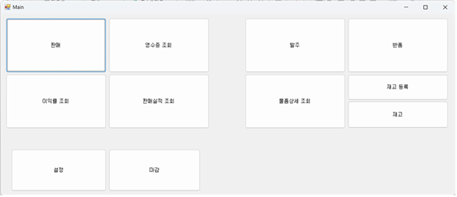
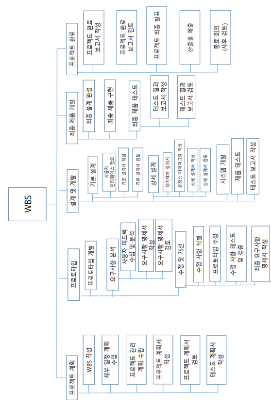
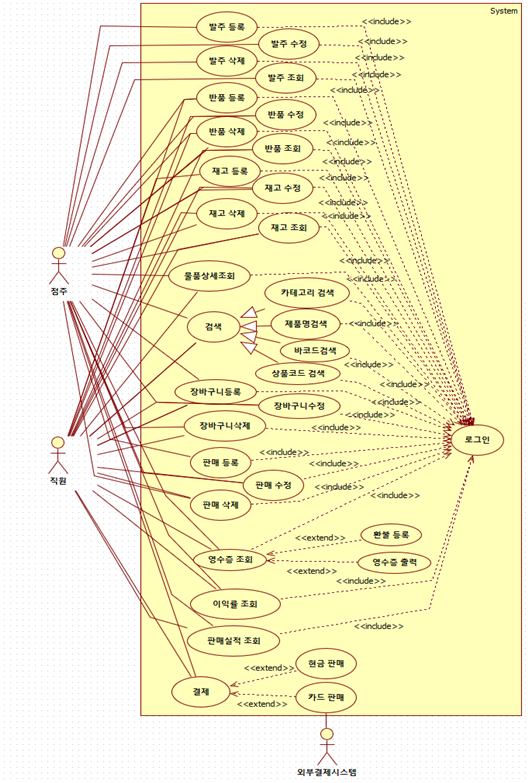
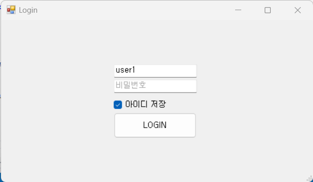
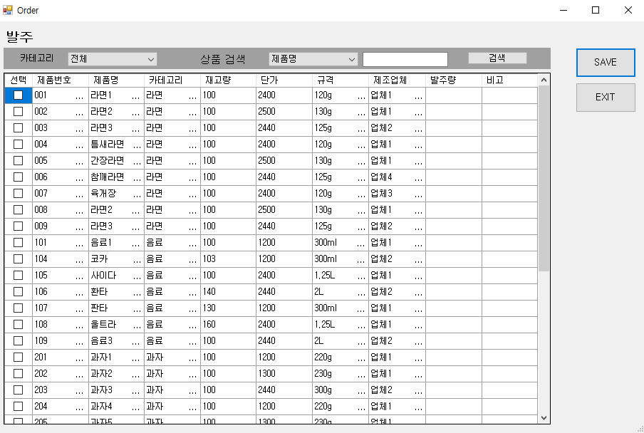
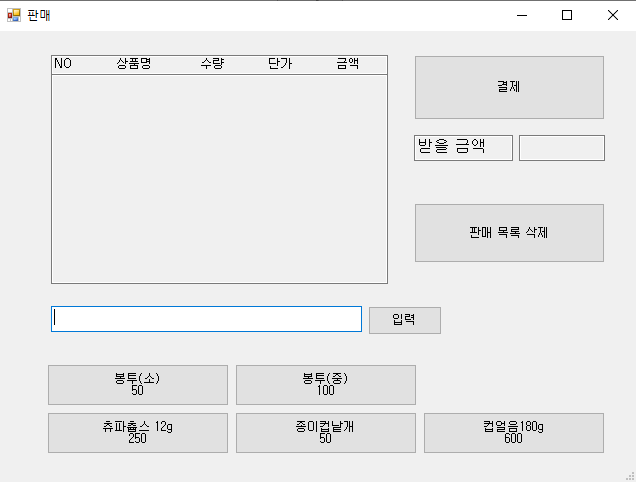
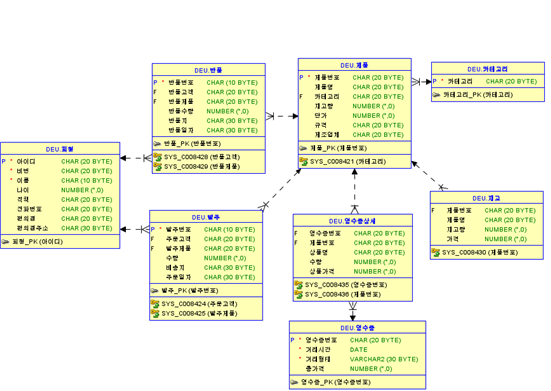
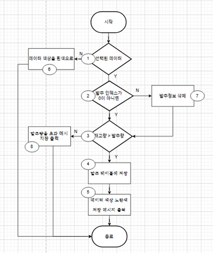

# 🏪 편의점 통합 운영 프로그램

동의대학교 소프트웨어공학 5조 팀 프로젝트입니다. 기존 편의점 시스템에서 결제 및 재고관리를 담당하는 포스기와 발주를 진행하는 웹사이트가 분리되어 발생하는 업무 비효율성을 해결하기 위해, 판매, 발주, 재고 관리, 반품, 실적 조회 기능을 통합한 Windows 데스크톱 프로그램을 개발했습니다.

## 1. 프로젝트 개요
* **개발 기간:** 2024. 03. 22 ~ 2024. 06. 07
* **개발 방법론:** 원형 모델 (Prototyping Model)
* **목적:** 분리된 편의점 운영 시스템의 통합 및 관리 효율성 증대

## 2. 개발 환경 및 사용 기술
* **Language:** C#
* **Database:** Oracle
* **IDE & Tool:** Visual Studio
* **OS:** Windows 10

## 3. 소프트웨어 공학 산출물 (Software Engineering Artifacts)
본 프로젝트는 소프트웨어 공학 프로세스에 따라 체계적으로 진행되었으며, 각 단계별로 산출물을 작성하여 프로젝트를 관리했습니다.

### 📌 작업 분할 구조도 (WBS)

### 📌 유스케이스 다이어그램 (Use Case Diagram)

* **계획 단계:** 프로젝트 계획서, WBS, 세부 일정 계획(간트차트), 기능 점수(Function Point) 기반 개발 규모 및 비용 산정 문서
* **분석 단계:** 요구사항 명세서, 유스케이스 다이어그램, 사용자 및 시스템 유스케이스 시나리오, 사용자 인터페이스(UI) 요구사항
* **설계 단계:** 시스템 아키텍처, 클래스 다이어그램(Boundary, Control, Entity), 시퀀스 다이어그램, 데이터베이스 ER 다이어그램 및 테이블 명세서
* **구현 및 테스트 단계:** 분기 커버리지 기반 화이트박스 테스트 케이스, 블랙박스 테스트 케이스, 리스크 관리(위험 분석 및 대응 방안) 보고서

## 4. 주요 기능

### 🔐 로그인 및 메뉴

* 사용자 계정(관리자/직원) 인증을 통한 보안 접근
* 직관적인 메뉴 UI를 통해 판매, 발주, 영수증 조회 등 핵심 기능으로 빠른 이동

### 🛒 판매 및 결제 관리

* 바코드 입력을 통한 상품 판매 등록, 취소 기능 및 Oracle DB 연동을 통한 영수증 정보 저장

### 📦 발주 및 재고 관리
* 카테고리/제품명 검색 기반 발주 등록 기능과 발주 데이터를 실제 매장 재고 테이블로 연동하여 관리하는 기능

### 📊 실적 및 이익률 조회
* 영업일자 기준 당일 판매 실적 조회, 일별/월별/대분류별 판매 실적 분석 및 원가/판매가 대비 이익률 산출 기능

### 🔄 반품 및 환불 처리
* 영수증 번호/날짜 조회를 통한 기존 판매 내역 확인, 환불 등록 및 재고 테이블 상품 개수 복구 기능

## 5. 데이터베이스 아키텍처
Oracle DB를 활용하여 총 8개의 주요 테이블로 구성되었습니다.

* **회원 (User):** 관리자 및 직원 계정 정보 관리
* **제품 (Product) & 카테고리 (Category):** 회사 공급 상품 기준 정보
* **재고 (Inventory):** 편의점 내 실제 보유 상품 수량 및 정보
* **영수증 (Receipt) & 영수증상세:** 판매 완료 거래 내역 및 결제 금액
* **발주 (Order) & 반품 (Return):** 입고 및 반품 처리 내역

## 6. 팀 구성 및 역할
본 프로젝트는 팀원 간의 평등한 의사소통을 중시하는 민주적 팀 구성 방식을 채택했습니다.

| 이름 | 담당 업무 |
| :--- | :--- |
| **유동수 (팀장)** | UI 디자인, 판매 기능 구현, 판매 유스케이스 시나리오 및 시퀀스 다이어그램 작성 |
| **허민재** | DB 설계 및 연동, 메인 UI/로그인/발주/재고 조회/판매실적 로직 구현, 화이트박스 테스트 작성 |
| **김재민** | DB 설계, 환불 등록 및 영수증 기능 구현, 환불 블랙박스/화이트박스 테스트 작성 |
| **백승훈** | UI 디자인, 재고 관리 기능 구현, 프로토타입 시나리오 설계, 결함/위험 분석 작성 |
| **송태훈** | 테스트 케이스 작성, 영수증 조회 기능 구현, 데이터베이스 ER 다이어그램 및 테이블 설계 |

## 7. 품질 검증 및 위기 관리
* **단위 테스트 (Whitebox Testing):** 발주 등록 시나리오에서 조건 분기 커버리지(Branch Coverage) 테스트를 수행하여 예외 상황(재고량 초과 등)의 오류를 디버깅했습니다.

* **리스크 관리:** 요구사항 변경, 인력/기술 부족 등의 리스크 요소를 식별하고, 발생 확률과 영향도에 따른 우선순위를 설정하여 예비 인력 보충 및 교육 등의 대응 방안을 문서화했습니다.
